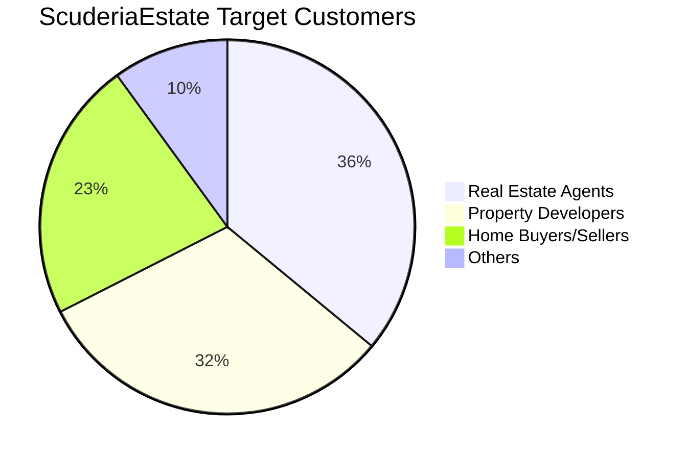
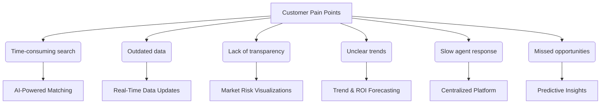

# ScuderiaEstate Execution Report 

## Who is our customer? 

ScuderiaEstate serves three core customer groups within the real estate sector:

| **Customer**             | **Value Proposition**                                                                 |
|--------------------------|--------------------------------------------------------------------------------------------------|
| Real Estate Agents       | To access real-time pricing trends and property insights, enabling better listings and faster deals. |
| Property Developers      | To compare property values across locations and forecast growth for strategic development planning. |
| Home Buyers & Sellers    | To make more informed decisions using AI-driven property valuations and market intelligence.     |

These groups share a need for accurate property valuation and data-driven decision-making. By providing smart analytics and predictive tools, ScuderiaEstate addresses the rising demand for market transparency among local and international buyers, while helping industry professionals overcome the tech adoption gap.

### Properties Price Trends in London and Opportunities 
Figure 1 demonstrated the annual changes in prime London propert from 2013 to 2023. It clearly showcased the market fluctuations which demonstrated the volatile nature of the London housing market.  Understanding these trends is essential for making informed decisions for real estate agents, property developers, and home buyers or sellers. Real estate agents can time listings and set competitive prices, developers can assess growth areas and market timing, and buyers or sellers can evaluate the best moments to transact. Therefore, ScuderiaEstate addresses the key pain points across these sectors by delivering AI-powered insights and predictive analytics—empowering users to make faster, data-driven decisions based on real-time pricing trends and market dynamics.

Figure 1. Changes in property prices in Central London

## Customer Needs and Pain Points
Real estate professionals and buyers often face challenges such as outdated data, unclear market trends, and time-consuming searches, which may impact their ability to evaluate property, resulting in missed investment opportunities. The flowchart below highlights the key pain points in the industry and how ScuderiaEstate’s AI-driven platform directly addresses them

## The Solution: ScuderiaEstate Offers a "Professional Eye"(Yuta Editting)
ScuderiaEstate is an intelligent, data-integrated platform designed to maximize accuracy and speed in real estate decision-making.

### 1. Smarter Search (Real-Time Data Updates + Centralized Platform)
With just one postcode input, ScuderiaEstate automatically collects and integrates current listings from multiple real estate platforms, displaying them intuitively on a map.
In a single view, users can compare prices, property types, bedroom counts, and floor areas—all in real time. This eliminates the effort and time normally spent navigating across different websites.

*[Scroll-based UI demo here]*

### 2. AI-Powered Price Forecasting (Predictive Insights + ROI Forecasting)
ScuderiaEstate features a machine learning–based price prediction engine powered by XGBoost.
It analyzes public datasets from 1995 to 2024, incorporating factors such as:

- Most recent sale prices and local benchmarks
- Long-term market trends in the surrounding area
- Property size, age, and layout
- Number of sales and property type distribution

With this, the platform offers highly accurate future price projections, enabling smarter investment and timing decisions.

*[Graph showing price forecast]*

### 3. Making the Invisible Visible (Market Risk Visualization + Trend & ROI Forecasting)
ScuderiaEstate integrates data from multiple public APIs and sources to quantify the “feel” of a neighborhood.

- Crime data: Visualized on the map via UK Police API
- Price history: Displayed using Land Registry API
- Demographics: Insights into age groups, education, industry, religion, and language use, based on Nomis datasets

Whether you're an overseas investor or a first-time home buyer, ScuderiaEstate helps you understand an area like a local real estate expert.

*[Crime map and price history graphs]*

### 4. Transparency(To be added)

### 5.  Future Expansion (AI-Powered Matching and More)
We are planning to implement the following enhancements:

- Personalized property recommendations based on user preferences
- ROI simulation tools to estimate potential investment returns
- Multi-area comparisons and custom alerts

These features aim to support even more strategic and personalized decision-making.

## What is our unique selling proposition (USP)? 
While there are several platforms that provide property-related data, most tend to focus narrowly on specific user groups—such as developers or landlords—or suffer from usability and accessibility issues, especially for individual buyers or first-time investors.
ScuderiaEstate stands out by combining comprehensive data coverage, intuitive design, and affordable pricing—all in one place.
The following comparison table highlights how our platform distinguishes itself from key competitors in the market.

| Feature / Platform                     | ScuderiaEstate | P Co. (Investor-Focused) | N Co. (Developer-Focused) | H Co. (General Public) |
|----------------------------------------|----------------|---------------|--------------|--------------|
| AI-Powered Price Forecasting       |  🟩Yes         | 🟥 No         | 🟥 No        | 🟥 No        |
| Crime & Risk Data Integration      |  🟩Yes         | 🟥 No         | 🟥 No        | 🟥 No        |
| Demographic & Area Insights        |  🟩Yes         | 🟥 No         | 🟥 No        | 🟥 No        |
| Historic Price Trends (Graph)      |  🟩Yes         | 🟩 Yes        | 🟩 Yes       | 🟨 Partial    |
| Ease of Use + Mobile-Friendly UI   |  🟩Yes   | 🟥 Complex UI | 🟥 Hard to use | 🟥 Outdated UI |
| Affordable Pricing                 |  🟩Yes         | 🟩 From £14   | 🟥 From £80  | 🟩 Free     |

ScuderiaEstate delivers the best of all worlds:
- **Comprehensive insights** that others overlook (crime, demographics, trends)
- **A clean and intuitive interface** suitable for all users
- **Smart AI capabilities** that bring clarity and confidence to your property decisions
- **Accessible pricing** for individuals, not just professionals

## Risks and Challenges (yuta editting)

Through interviews with several potential customers, concerns were raised regarding Data Security, Privacy, and Fraud Risk in relation to our business.
Our platform targets overseas real estate investors and handles both financial transactions and personal information.
There is a risk that malicious users could impersonate others, or that our platform could be exploited for money laundering or the movement of funds by criminal organizations.
Failure to address these risks could result in legal penalties, reputational damage, and even orders to cease business operations.

To mitigate these risks, we will implement a robust KYC process to verify the identities of our users and prevent unauthorized access and illicit activity.
By doing so, we aim to comply with GDPR and AML (Anti-Money Laundering) regulations, and build trust with our customers.

Furthermore, using AI technology, we will continuously monitor transactions for unusual activity and report to authorities as necessary.
This will provide a safe and secure trading environment for users.
We will also properly collect, store, and protect customer personal data in full compliance with GDPR.

According to Chainalysis(https://www.chainalysis.com/blog/what-is-aml-and-kyc-for-crypto/#why-kyc), implementing KYC does not significantly reduce the number of users, demonstrating that illegal usage can be prevented without harming user acquisition, allowing businesses to expand globally.

Additionally, according to CipherTrace, Inc., exchanges operating in countries with weak AML regulations receive 36 times more illicit Bitcoin deposits and send 18 times more illicit funds compared to those in countries with strict regulations.( CipherTrace, CipherTrace, Inc., “Cryptocurrency Anti-Money Laundering Report - Q3 2018)
This indicates that adhering to AML and CFT (Counter Financing of Terrorism) regulations can greatly reduce criminal risks.

Automating financial document processing enhances speed, reduces errors, improves security, and lowers costs.( https://www.proof.com/blog/the-value-of-financial-document-automation)

## ScuderiaEstate Pitch Desk Presentation 

[Click here to view the presentation on Google Slides](https://docs.google.com/presentation/d/11KkG5xj1vkZ622lKEnxMnsd5oPqY6OUPHs0R4FBtbwY/edit?usp=sharing)

