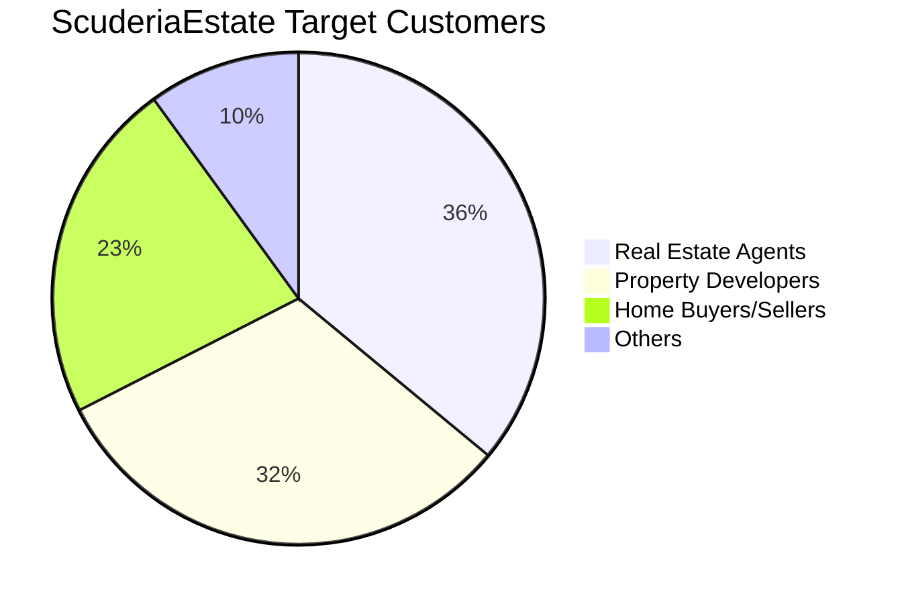
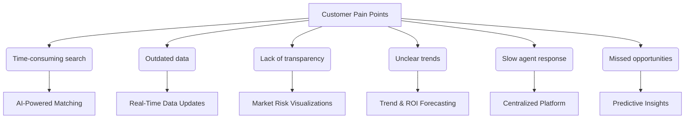

# ScuderiaEstate Execution Report 

## Who is our customer? 

ScuderiaEstate serves three core customer groups within the real estate sector:

| **Customer**             | **Value Proposition**                                                                 |
|--------------------------|--------------------------------------------------------------------------------------------------|
| Real Estate Agents       | To access real-time pricing trends and property insights, enabling better listings and faster deals. |
| Property Developers      | To compare property values across locations and forecast growth for strategic development planning. |
| Home Buyers & Sellers    | To make more informed decisions using AI-driven property valuations and market intelligence.     |

These groups share a need for accurate property valuation and data-driven decision-making. By providing smart analytics and predictive tools, ScuderiaEstate addresses the rising demand for market transparency among local and international buyers, while helping industry professionals overcome the tech adoption gap.

### Properties Price Trends in London and Opportunities 
Figure 1 demonstrated the annual changes in prime London propert from 2013 to 2023. It clearly showcased the market fluctuations which demonstrated the volatile nature of the London housing market.  Understanding these trends is essential for making informed decisions for real estate agents, property developers, and home buyers or sellers. Real estate agents can time listings and set competitive prices, developers can assess growth areas and market timing, and buyers or sellers can evaluate the best moments to transact. Therefore, ScuderiaEstate addresses the key pain points across these sectors by delivering AI-powered insights and predictive analytics—empowering users to make faster, data-driven decisions based on real-time pricing trends and market dynamics.

Figure 1. Changes in property prices in Central London

## Customer Needs and Pain Points
Real estate professionals and buyers often face challenges such as outdated data, unclear market trends, and time-consuming searches, which may impact their ability to evaluate property, resulting in missed investment opportunities. The flowchart below highlights the key pain points in the industry and how ScuderiaEstate’s AI-driven platform directly addresses them

## How will our product meet the needs?
ScuderiaEstate is an intelligent, data-integrated platform designed to maximize accuracy and speed in real estate decision-making.

### 1. Smarter Search (Real-Time Data Updates + Centralized Platform)
With just one postcode input, ScuderiaEstate automatically collects and integrates current listings from multiple real estate platforms, displaying them intuitively on a map.
In a single view, users can compare prices, property types, bedroom counts, and floor areas—all in real time. This eliminates the effort and time normally spent navigating across different websites.

*[Scroll-based UI demo here]*

### 2. AI-Powered Price Forecasting (Predictive Insights + ROI Forecasting)
ScuderiaEstate features a machine learning–based price prediction engine powered by XGBoost.
It analyzes public datasets from 1995 to 2024, incorporating factors such as:

- Most recent sale prices and local benchmarks
- Long-term market trends in the surrounding area
- Property size, age, and layout
- Number of sales and property type distribution

With this, the platform offers highly accurate future price projections, enabling smarter investment and timing decisions.

*[Graph showing price forecast]*

### 3. Making the Invisible Visible (Market Risk Visualization + Trend & ROI Forecasting)
ScuderiaEstate integrates data from multiple public APIs and sources to quantify the “feel” of a neighborhood.

- Crime data: Visualized on the map via UK Police API
- Price history: Displayed using Land Registry API
- Demographics: Insights into age groups, education, industry, religion, and language use, based on Nomis datasets

Whether you're an overseas investor or a first-time home buyer, ScuderiaEstate helps you understand an area like a local real estate expert.

*[Crime map and price history graphs]*

### 4. Built on Trust and Transparency
Trust is a top concern for individual buyers and sellers. Scuderia Estate ensures that sensitive information is shared only after strict identity checks, as shown in Figure X.
Our service ensures transparency and trust through strict customer verification and robust data protection. We use a three step KYC process: starting with customer identification, followed by customer due diligence, and enhanced due diligence for high risk users. This allows only trusted customers to access our platform. In addition, personal data is protected with SSL/TLS during transmission and securely encrypted with AES after receipt. Regular audits guarantee strict GDPR compliance, ensuring that all user information remains private and secure.

FigureX. Customer Screening and Privacy Protection

### 5.  Future Expansion (AI-Powered Matching and More)
We are planning to implement the following enhancements:

- Personalized property recommendations based on user preferences
- ROI simulation tools to estimate potential investment returns
- Multi-area comparisons and custom alerts

These features aim to support even more strategic and personalized decision-making.

## What is our unique selling proposition (USP)? 
While many platforms provide property-related data, they tend to serve only specific user groups—such as investors, developers, or landlords—and often come with complex interfaces, high subscription costs, or outdated designs. This creates barriers for first-time buyers and individual investors who need clarity and confidence when making property decisions. Scuderia Estate sets itself apart by offering a unified, user-friendly platform that brings together the most critical insights in one place. Figure X illustrates how existing platforms are positioned in relation to their target users and common limitations.

FigureX. Competitor Positioning Overview

Our service integrates AI powered price forecasting, crime and environmental risk data, and demographic insights, which are often overlooked by competitors. Unlike platforms that require technical expertise or large budgets, Scuderia Estate is designed for accessibility, with an intuitive interface and affordable pricing that make it easy for anyone to use, whether on desktop or mobile. In a market where other services feel fragmented or overwhelming, Scuderia Estate delivers clarity, reliability, and smart technology in one seamless experience. This is clearly shown in Table 2.

Table. Feature Comparison Across Platforms
| Feature               | ScuderiaEstate | PropertyData | Nimbus Maps | LandInsight | Lendlord | Home.co.uk |
|-----------------------|----------------|---------------|--------------|--------------|-----------|--------------|
| Price (per month)     | £X (Affordable) | £14+         | £80–150      | £45–135      | Free / £12 | Free         |
| Market Insights       | ✅             | ✅           | ✅           | ✅           | ❌        | ✅ (Basic) |
| Crime Data            | ✅             | ❌           | ❌           | ❌           | ❌        | ❌           |
| Beginner Friendly     | ✅             | ❌           | ❌           | ❌           | ✅        | ❌           |
| Mobile Friendly       | ✅             | ✅           | ❌           | ❌           | ✅        | ❌           |
| Investor Oriented     | ✅             | ✅           | ✅           | ✅           | ❌        | ❌           |

## Risks and Challenges (yuta editting)

Through interviews with several potential customers, concerns were raised regarding Data Security, Privacy, and Fraud Risk in relation to our business.
Our platform targets overseas real estate investors and handles both financial transactions and personal information.
There is a risk that malicious users could impersonate others, or that our platform could be exploited for money laundering or the movement of funds by criminal organizations.
Failure to address these risks could result in legal penalties, reputational damage, and even orders to cease business operations.

## ScuderiaEstate Pitch Desk Presentation 

[Click here to view the presentation on Google Slides](https://docs.google.com/presentation/d/11KkG5xj1vkZ622lKEnxMnsd5oPqY6OUPHs0R4FBtbwY/edit?usp=sharing)

