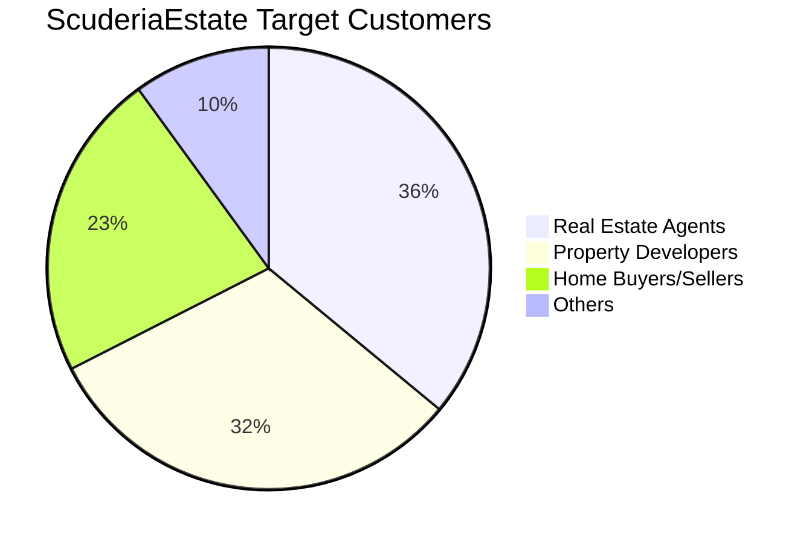
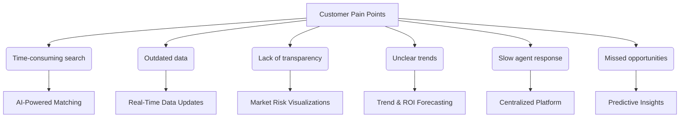

# ScuderiaEstate Execution Report 

## Who is our customer? 

ScuderiaEstate serves three core customer groups within the real estate sector:

| **Customer**             | **Value Proposition**                                                                 |
|--------------------------|--------------------------------------------------------------------------------------------------|
| Real Estate Agents       | To access real-time pricing trends and property insights, enabling better listings and faster deals. |
| Property Developers      | To compare property values across locations and forecast growth for strategic development planning. |
| Home Buyers & Sellers    | To make more informed decisions using AI-driven property valuations and market intelligence.     |

These groups share a need for accurate property valuation and data-driven decision-making. By providing smart analytics and predictive tools, ScuderiaEstate addresses the rising demand for market transparency among local and international buyers, while helping industry professionals overcome the tech adoption gap.

### Properties Price Trends in London and Opportunities 
Figure 1 demonstrated the annual changes in prime London propert from 2013 to 2023. It clearly showcased the market fluctuations which demonstrated the volatile nature of the London housing market.  Understanding these trends is essential for making informed decisions for real estate agents, property developers, and home buyers or sellers. Real estate agents can time listings and set competitive prices, developers can assess growth areas and market timing, and buyers or sellers can evaluate the best moments to transact. Therefore, ScuderiaEstate addresses the key pain points across these sectors by delivering AI-powered insights and predictive analytics—empowering users to make faster, data-driven decisions based on real-time pricing trends and market dynamics.

Figure 1. Changes in property prices in Central London

## Customer Needs and Pain Points
Real estate professionals and buyers often face challenges such as outdated data, unclear market trends, and time-consuming searches, which may impact their ability to evaluate property, resulting in missed investment opportunities. The flowchart below highlights the key pain points in the industry and how ScuderiaEstate’s AI-driven platform directly addresses them

## The Solution: ScuderiaEstate Offers a "Professional Eye"
ScuderiaEstate is an intelligent, data-integrated platform designed to maximize accuracy and speed in real estate decision-making.

- AI-driven property valuation provides forward-looking insights
- Real-time listing aggregation reduces time-consuming manual searches
- Quantified market risks and demographic data reveal the unseen side of each area
- Consolidated map-based interface shows everything in one place

In short, any user can make decisions like a professional real estate analyst.

### 1. Smarter Search (Real-Time Data Updates + Centralized Platform)
With just one postcode input, ScuderiaEstate automatically collects and integrates current listings from multiple real estate platforms, displaying them intuitively on a map.
In a single view, users can compare prices, property types, bedroom counts, and floor areas—all in real time. This eliminates the effort and time normally spent navigating across different websites.

*[Scroll-based UI demo here]*

### 2. AI-Powered Price Forecasting (Predictive Insights + ROI Forecasting)
ScuderiaEstate features a machine learning–based price prediction engine powered by XGBoost.
It analyzes public datasets from 1995 to 2024, incorporating factors such as:

- Most recent sale prices and local benchmarks
- Long-term market trends in the surrounding area
- Property size, age, and layout
- Number of sales and property type distribution

With this, the platform offers highly accurate future price projections, enabling smarter investment and timing decisions.

*[Graph showing price forecast]*

### 3. Making the Invisible Visible (Market Risk Visualization + Trend & ROI Forecasting)
ScuderiaEstate integrates data from multiple public APIs and sources to quantify the “feel” of a neighborhood.

- Crime data: Visualized on the map via UK Police API
- Price history: Displayed using Land Registry API
- Demographics: Insights into age groups, education, industry, religion, and language use, based on Nomis datasets

Whether you're an overseas investor or a first-time home buyer, ScuderiaEstate helps you understand an area like a local real estate expert.

*[Crime map and price history graphs]*

### 4. Transparency

### 5.  Future Expansion (AI-Powered Matching and More)
We are planning to implement the following enhancements:

- Personalized property recommendations based on user preferences
- ROI simulation tools to estimate potential investment returns
- Multi-area comparisons and custom alerts

These features aim to support even more strategic and personalized decision-making.

## ScuderiaEstate Pitch Desk Presentation 

[Click here to view the presentation on Google Slides](https://docs.google.com/presentation/d/11KkG5xj1vkZ622lKEnxMnsd5oPqY6OUPHs0R4FBtbwY/edit?usp=sharing)

