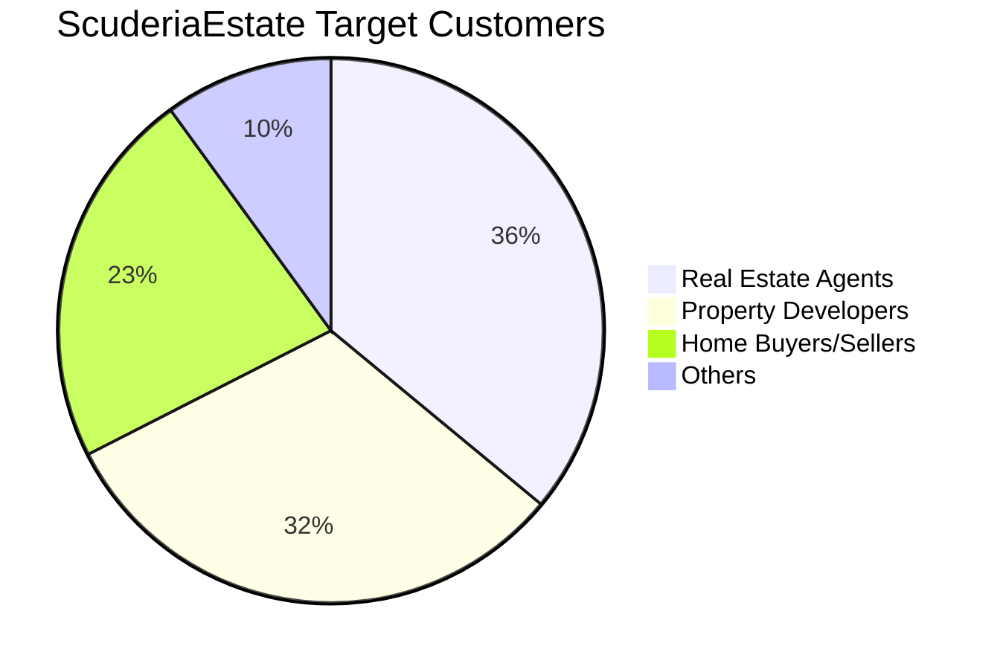
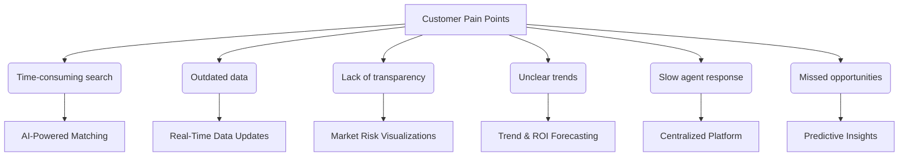

# ScuderiaEstate Execution Report 

## Who is our customer? 

ScuderiaEstate serves three core customer groups within the real estate sector:

| **Customer**             | **Value Proposition**                                                                 |
|--------------------------|--------------------------------------------------------------------------------------------------|
| Real Estate Agents       | To access real-time pricing trends and property insights, enabling better listings and faster deals. |
| Property Developers      | To compare property values across locations and forecast growth for strategic development planning. |
| Home Buyers & Sellers    | To make more informed decisions using AI-driven property valuations and market intelligence.     |

These groups share a need for accurate property valuation and data-driven decision-making. By providing smart analytics and predictive tools, ScuderiaEstate addresses the rising demand for market transparency among local and international buyers, while helping industry professionals overcome the tech adoption gap.

### Properties Price Trends in London and Opportunities 
Figure 1 demonstrated the annual changes in prime London propert from 2013 to 2023. It clearly showcased the market fluctuations which demonstrated the volatile nature of the London housing market.  Understanding these trends is essential for making informed decisions for real estate agents, property developers, and home buyers or sellers. Real estate agents can time listings and set competitive prices, developers can assess growth areas and market timing, and buyers or sellers can evaluate the best moments to transact. Therefore, ScuderiaEstate addresses the key pain points across these sectors by delivering AI-powered insights and predictive analytics—empowering users to make faster, data-driven decisions based on real-time pricing trends and market dynamics.

Figure 1. Changes in property prices in Central London

## Customer Needs and Pain Points
Real estate professionals and buyers often face challenges such as outdated data, unclear market trends, and time-consuming searches, which may impact their ability to evaluate property, resulting in missed investment opportunities. The flowchart below highlights the key pain points in the industry and how ScuderiaEstate’s AI-driven platform directly addresses them

### value proposition
To address these needs, customers require a service that ensures the credibility and reliability of transaction partners, supported by transparent processes. The service should provide land price information based on clear and trustworthy data sources, making both the data and its origins accessible to users. It must offer transparency not only in pricing but also in matching, helping users verify who they are dealing with and under what conditions. By delivering data-driven insights and maintaining openness throughout the transaction process, such a service would reduce uncertainty and risk, making land buying and selling safer and more efficient. 

## What is the product
Our service allows users to enter a postcode and receive detailed insights about the surrounding area, including predicted property prices, crime levels, and demographic information. It collects data from various public APIs, such as the UK Land Registry for historical property transactions, the UK Police API for crime statistics, and the Nomis API for population demographics. These datasets are processed by a machine learning model (e.g., XGBoost), which uses features like past sale prices, housing types, and average floor size to estimate future property values. When data is limited, the model intelligently supplements it with broader regional trends. The results are displayed through a user-friendly, map-based interface built with Leaflet.js, providing users—especially foreign investors—with a comprehensive and trustworthy view of local risks and opportunities.

## ScuderiaEstate Pitch Desk Presentation 

[Click here to view the presentation on Google Slides](https://docs.google.com/presentation/d/11KkG5xj1vkZ622lKEnxMnsd5oPqY6OUPHs0R4FBtbwY/edit?usp=sharing)

